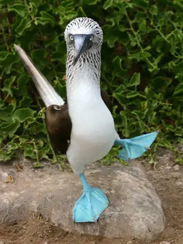

# boobies
--- 
- CheckAI_hack.pdf - презентация
- sandbox - промты для гпт
- boobies.zip - статьи, решения
- boobies_large.zip - больший объем статей

---
Буби называют белых птиц с желтым хохолком, обитающих в лесу Пьерос в пятидесяти километрах от Хага. Они раз в жизни выводят потомство. После живут тем, что облетают гнезда других птиц, принося их детенышам добытую пищу. Буби – символ бескорыстной любви.
